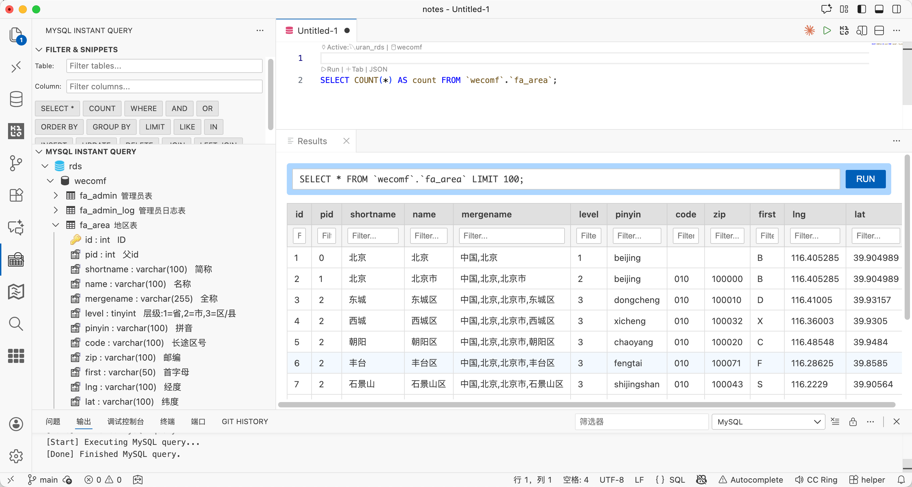
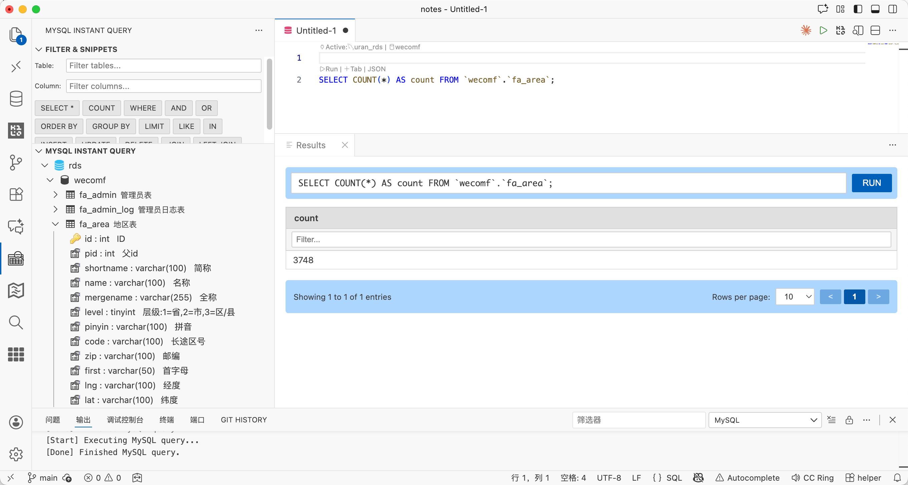

# MySQL Blade

A powerful and efficient MySQL management tool for Visual Studio Code with advanced filtering, snippets, and table management capabilities.

## Screenshots

*screenshot*

*count*

*select column*

*select filter*

## Features

### Core Functionality
- **Manage MySQL Connections** - Support SSL connections with secure password storage
- **Browse MySQL Structure** - Navigate servers, databases, tables, and columns in a tree view
- **Run SQL Queries** - Execute queries with result preview and syntax highlighting
- **Edit Connection Display Names** - Customize how your connections appear

### Advanced Filtering
- **Table Filter** - Quickly filter tables by name or comment in real-time
- **Column Filter** - Filter columns within tables by name, type, or comment
- **Auto-Expand** - Tables automatically expand when column filter is active

### SQL Snippets Panel
Quick-access buttons for common SQL keywords and patterns:
- `SELECT *`, `COUNT`, `WHERE`, `AND`, `OR`
- `ORDER BY`, `GROUP BY`, `LIMIT`, `LIKE`, `IN`
- `INSERT`, `UPDATE`, `DELETE`, `JOIN`, `LEFT JOIN`

### Table Management
- **Pin Tables** - Pin frequently used tables to the top for quick access
- **Double-Click Table** - Quickly select top 100 rows
- **Table Structure View** - View detailed table structure with columns, keys, indexes, and sample data
- **Copy Table Name** - One-click copy to clipboard
- **Count Rows** - Get row count for any table
- **Add Column** - Interactive column creation wizard
- **Drop Table** - Delete tables with confirmation
- **Backup Table** - Create timestamped table backups

### Column Operations
- **Select Column** - Query a single column with auto-ordering
- **Select with Filter** - Apply WHERE conditions to column queries
- **Copy Column Name** - Copy column name to clipboard
- **Insert Column Name** - Insert column name at cursor position
- **Drop Column** - Generate DROP COLUMN SQL

### UI Enhancements
- **Smart Expand/Collapse** - Dynamic icons that change based on state
- **System Database Filter** - Hides system databases (information_schema, mysql, performance_schema, sys)
- **Table Comments** - View table comments in tooltips and descriptions
- **Column Details** - View column name, type, and comment in a clean format

## Usage

### Add MySQL Connection

1. Click the **MySQL Blade** icon in the Activity Bar
2. Click the **+** button in the sidebar
3. Enter connection details:
   - Host
   - Username
   - Password (securely stored)
   - Port (default: 3306)
   - SSL certificate path (optional)

### Run SQL Query

Open a SQL file, then use one of these methods:
- Right-click and select **Run MySQL Query**
- Use shortcut: `Ctrl+Alt+E` (Windows/Linux) or `Cmd+Alt+E` (macOS)
- Press `F1` and type `Run MySQL Query`

You can also select a portion of SQL to run only the selected query.

### Quick Table Access

- **Double-click** any table to select the top 100 rows
- **Pin** frequently used tables by right-clicking and selecting "Pin Table"

### Filter Tables & Columns

Use the **Filter & Snippets** panel at the top of the sidebar:
- Type in the **Table** field to filter tables
- Type in the **Column** field to filter columns within expanded tables
- Click snippet buttons to insert SQL keywords into your editor

### Keyboard Shortcuts

| Key | Command |
|-----|---------|
| `Ctrl+Alt+E` / `Cmd+Alt+E` | Run MySQL Query |
| `Ctrl+Shift+T` / `Cmd+Shift+T` | Open Table |
| `Ctrl+Shift+F` / `Cmd+Shift+F` | Focus Table Filter |

## Settings

| Setting | Default | Description |
|---------|---------|-------------|
| `vscode-mysql.maxTableCount` | `500` | Maximum number of tables shown in tree view |
| `vscode-mysql.enableDelimiterOperator` | `true` | Enable support for DELIMITER operator |
| `vscode-mysql.enableTelemetry` | `true` | Anonymous usage collection |

## Requirements

- Visual Studio Code 1.83.0 or higher
- MySQL 5.0 or higher (including MySQL 8.0+)

## Repository

[GitHub Repository](https://github.com/meetrice/vscode-mysql-blade)

This is an enhanced version of the original [vscode-mysql](https://github.com/formulahendry/vscode-mysql) by formulahendry.

## Contributing

Contributions are welcome! Please feel free to submit a Pull Request.

## License

MIT

## Marketplace

[Install from VSCode Marketplace](https://marketplace.visualstudio.com/items?itemName=meetrice.mysql-blade)

---

**Enjoy using MySQL Blade!** ??
